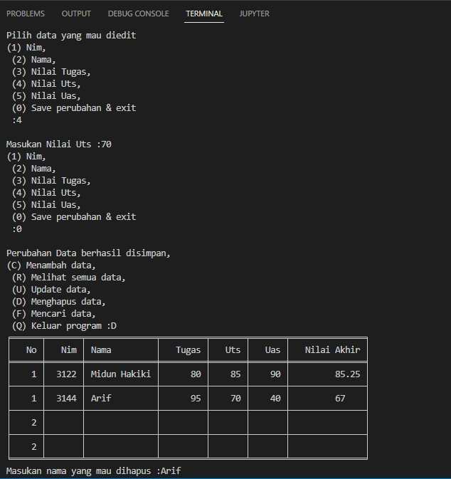
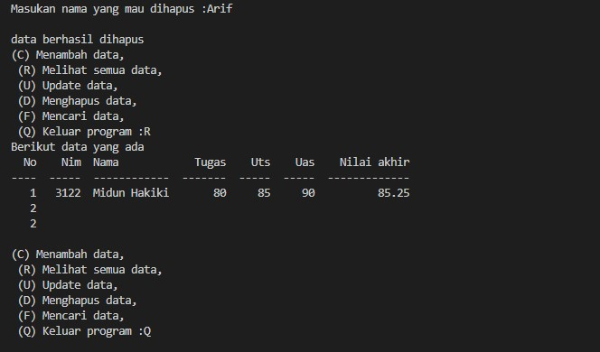

#   Nama    : Midun Hakiki
#   Nim     : 312210583
#   Kelas   : 22.TI.B1
#   Matkul  : Bahasa Pemograman
#   ------------------------------------

#   Langkah-langkah cara Menggunakan Function dan Lambda pada python dan membuat program crud sederhana

#   1.) Buat folder terlebih dahulu seperti contoh di bawah ini :
    
-   11-function-lambda
   
    Didalamnya kita buat file dengan nama 
        
        -   Latihan.py
        -   Praktikum6.py
  

#   2.) Buka file Latihan.py
Masukan coding sebagai berikut :

Setalah codingnya sudah selesai di isi, Maka selanjut tekan Terminal(run) dengan mengetikan perintah berikut diterminal python Latihan.py

#   Hasilnya

#   3.) Selanjutnya kita akan buat program crud sederhana dan berikut flowchart program yang akan dibuat.

#   4.) Buka file Praktikum6.py

Masukan codingnya sebagai berikut :

#   Hasilnya

-   Jika memilih opsi C = menambah data maka akan tampil sebagai berikut :

-   Jika memilih opsi R = Melihat semua data
-   Dan memilih opsi U = Mengupdate data

Maka akan tampil sebagai berikut :

-   Jika memilih opsi D = Menghapus data maka akan tampil sebagai berikut :

-   Dan Kembali memilih opsi R = Melihat data, (Perubahan Data) maka akan tampil sebagai berikut :

-   Yang terakhir Jika memilih opsi Q = Keluar Program maka akan tampil sebagai berikut :

#   Selesai...
#   Inilah hasil dari Function dan Lambda pada python dan membuat program crud sederhana.
#   Terimaksih...
#   Salah Sehati Anak IT...
